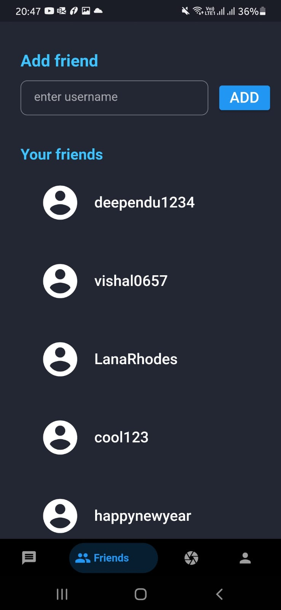
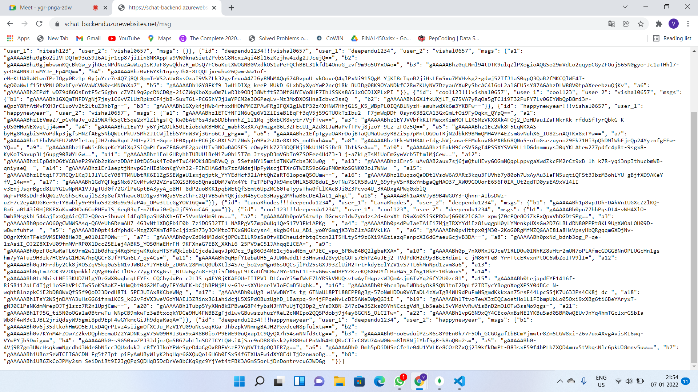
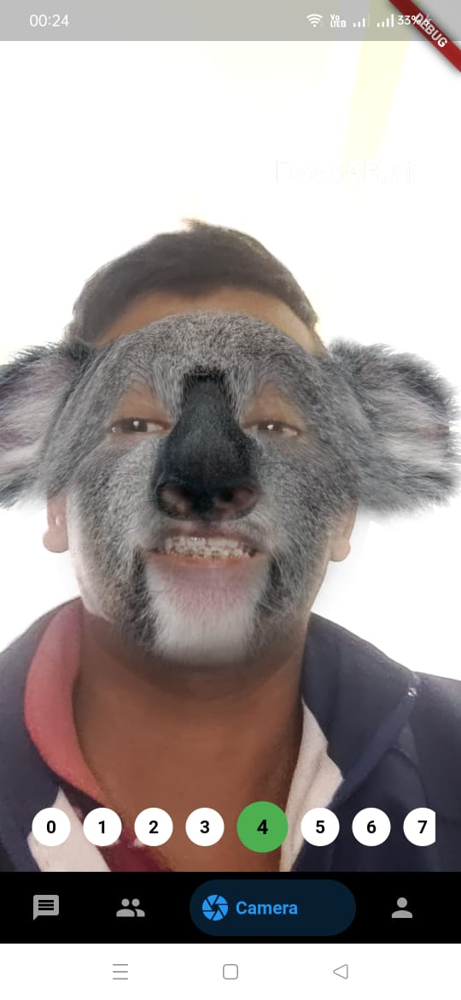

# S_CHAT
## secure | smart | safe

S_Chat from Team Noob is a FREE messaging with inbuilt AR technology. It’s simple, reliable, and private, so you can easily keep in touch with your friends and family. S_Chat works across mobile even on slow connections, with no subscription fees*.

## Details
##### Team Name 
Team_Noob
##### Domain of our project 
Highly secure chatting application with inbuilt Augmented reality features.
##### Idea 
It’s simple, reliable, and secure, so you can easily keep in touch with your friends and family ,click pictures with cool effects.
##### Achievements 
• Successfully linked fire base OTP authentication with Mongo DB database in our flutter chatting application.
• Added feature of capturing pictures with cool effects (Augmented reality).
• Created API for adding and removing friends in django backend.
• Created user interface for our chatting application in FLUTTER framework.
• Used API for performing various task in flutter frontend.
   1. Adding friends
   2. Searching friends
   3. Sending and Receiving messages
  
• Created  NO SQL database for storing messages (Mongo_DB).
• Storing messages in encrypted format using Fernet (symmetric encryption).

## Features

Your personal messages to friends and family are end-to-end encrypted. No one outside of your chats, not even S_Chat, can read or listen to them.
All you need is your phone number, user name to get started with. You can quickly view your friends who are on S_Chat and start messaging.

    • S_Chat opens straight to the camera — just tap to take a photo .
    • Express yourself with Lenses, Filters, Bitmoji and more!
    •Try out new Lenses created daily by the S_Chat community.
     

 

## Tech

Team Noob uses a number of open source projects to work properly:

- [Flutter] - version 2.8.0 framework for android apps!
- [[Django](https://github.com/vishalsharma0657/schat-backend.git)] - Django provides fast and secure backend.
- [Fire_Base] - Fire_base provides one time password for verification in S_Chat application.
- [Mongo_DB] - Mongo_db provides database to the application for storing messages and user detail in encrypted format.

And of course S_Chat itself is open source with a [public repository][dill]
 on GitHub.

## Setup

Download from here -->  [S_Chat](https://drive.google.com/file/d/1NsfF_Ez4ZH7Yp57uyiypIXuqulxy8MY5/view?usp=sharing)

MinSdkVersion 26,
TargetSdkVersion 29

