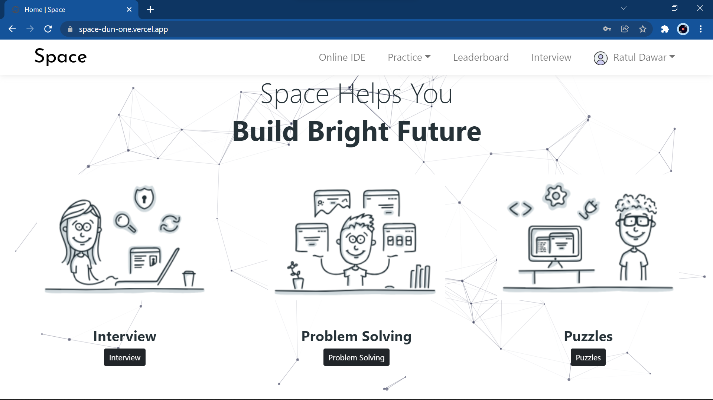
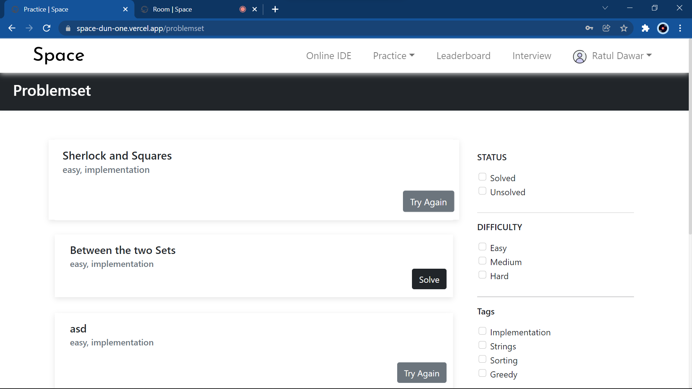
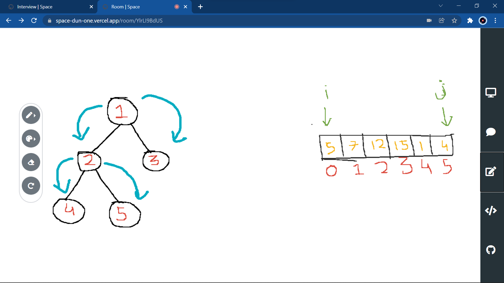

<div id="top" align="center"></div>

<!--
[![Contributors][contributors-shield]][contributors-url]
[![Stargazers][stars-shield]][stars-url]
-->
<!-- PROJECT LOGO -->
<br />
<div align="center">
  <a href="https://=github.com/Rishika-05/Space">
    
  </a>
<!--
  <h3 align="center">Space/h3>
-->
  <h3 align="center">
    A Space to practice and achieve DREAMS
    <br />
    <br />
    <a href="https://space-dun-one.vercel.app">Live Website</a>
  </h3>
  <i>PS - Don't try to compile code because we won't be bearing hefty cloud charges😪 </i>
</div>


<br/>
<!-- TABLE OF CONTENTS -->
<details>
  <summary>Table of Contents</summary>
  <ol>
     <li><a href="#domain">Domain</a></li>
    <li>
      <a href="#about-the-project">About The Project</a>
      <ul>
        <li><a href="#built-with">Built With</a></li>
      </ul>
    </li>
    <li><a href="#achievements">Achievements</a></li>
    <li>
      <a href="#getting-started">Getting Started</a>
      <ul>
        <li><a href="#prerequisites">Prerequisites</a></li>
        <li><a href="#installation">Installation</a></li>
      </ul>
    </li>
    <li><a href="#team">Our Team</a></li>
  </ol>
</details>

<!-- DOMAIN -->
## Domain

- Full-Stack Web Development

<!-- ABOUT THE PROJECT -->
## About The Project



Space, a new way to learn and practice! Space is the best integrated platform to enhance your technical skills and practice for you interviews.

Here's why:
* Low latency, high quality real-time audio-video interface, whiteboard, chat & IDE.
* Practice problems & submit it on our Space online judge.

<p align="right">(<a href="#top">Back to top</a>)</p>


### Built With

Technologies used - 

<p align="left" style="background-color:white"> 
<a href="https://reactjs.org/" target="_blank"> </a> 
&nbsp;&nbsp;
<a href="https://nodejs.org/en/" target="_blank"> </a>  
&nbsp;&nbsp;
<a href="https://www.mongodb.com/" target="_blank"> </a> 
&nbsp;&nbsp;
<a href="https://socket.io/" target="_blank">  </a>
&nbsp;&nbsp;
<a href="https://expressjs.com/" target="_blank">  </a>
&nbsp;&nbsp;
<a href="https://cloud.google.com/" target="_blank">  </a> 
&nbsp;&nbsp;
<a href="https://firebase.google.com/" target="_blank">  </a>
&nbsp;&nbsp;
<a href="https://www.ssh.com/academy/ssh" target="_blank">  </a>
&nbsp;&nbsp;
  <a href="https://www.agora.io/en/" target="_blank">  </a>
</p>

<p align="right">(<a href="#top">Back to top</a>)</p>


<!-- ACHIEVEMENTS -->
## Achievements
1. **User Profile** :
    * Users can create account and verify themselves using email.
    * Verified users can login, edit their profile summary, see their progress using progress calender and also track the questions they have solved.
2. **Problemset and Puzzles** :
    * Users can view problems on our website and filter them on the basis of difficulty,topic and solved-unsolved.
    * Users can also brain storm on our mind-bending puzzles.
    * 
3. **IDE** :
    * Users can code solutions on our website using Space IDE.
    * Users can submit their solutions and get judgement verdicts like - Accepted, Rejected, Compilation Error and Time Limit Exceeded with our Google Cloud Platform powered       IDE.
    *  
4. **Interview** :
    * Automatic scheduling of interviews via email with room ID, date and time.
    * Conduct and give interactive interviews using audio-video interface.
    * Share important links and handles using Space real-time chat.
    * Users can also share their ideas via drawings using Space real-time collaborative whiteboard.
    *  
    * Users can showcase thier coding skills to the interviewer using Space collaborative IDE.
    * Users can look up their github profiles via space github viewer.
    * 
5. **Admin Portal** :
    * Space admins can login and create problems and puzzles for users.
    * Admins can also track the problems that they have created.

    <p align="right">(<a href="#top">Back to top</a>)</p>
<!-- GETTING STARTED -->

## Getting Started

To get a local copy up and running follow these simple example steps.

### Prerequisites

This is an example of how to list things you need to use the software and how to install them.
* npm
  ```sh
  npm install npm@latest -g
  ```

### Installation


1. Clone the repo
   ```sh
   git clone https://github.com/your_username_/Project-Name.git
   ```
 #### For Client
1. Install NPM packages
   ```sh
   npm install
   ```
2. Create a .env file and add following data - 
   ```sh
   # Add emailjs credentials
   REACT_APP_SERVICE_KEY="YOUR_SERVICE_KEY"
   REACT_APP_IR_KEY="YOUR_TEMPLATE_ID"
   REACT_APP_IE_KEY="YOUR_TEMPLATE_ID"
   REACT_APP_USER_KEY="YOUR_USER_KEY"
   # Add Firebase Config 
   REACT_APP_API_KEY="FIREBASE_API_KEY"
   REACT_APP_AUTHD="FIREBASE_AUTH_DOMAIN"
   REACT_APP_PRO_ID="FIREBASE_PROJECT_ID"
   REACT_APP_STOREB="FIREBASE_STORAGE_BUCKET"
   REACT_APP_MSG_ID="FIREBASE_MESSENGING_SENDER_ID"
   REACT_APP_ID="FIREBASE_APP_ID"
   # Add the server
   REACT_APP_SERVER_URL="SERVER_URL"
   ```
   
3. To run the frontend -
   ```sh 
   npm start
   ```
   
#### For Server
1. Install NPM packages
   ```sh
   npm install
   ```
2. Create a .env file and add following data - 
   ```sh
   PORT="ANY_ PORT" || 9000
   DATABASE="MONGODB_URL"
   # Agora credentials
   APP_CERTIFICATE="YOUR_AGORA_APP_CERTIFICATE"
   APP_ID="YOUR_AGORA_APP_ID"
   # Virtual machine host IP
   VM_HOST_IP="YOUR_HOST_MACHINE_IP"
   # SSH credentials
   SSH_CONNECTOR_USERNAME="YOUR_SSH_USERNAME"
   SSH_CONNECTION_PORT="ANY_SSH_PORT" 
   SSH_KEY="YOUR_SSH_KEY" # SSH key must be without BEGIN HEADER and END HEADER
   ```
   
3. To run the backend -
   ```sh 
   npm start
   ```
   

<p align="right">(<a href="#top">Back to top</a>)</p>

### Team
  - **Team Name** : PBX1
  - **Team Members** : 
      * [Ratul Dawar](https://github.com/RatulDawar)
      * [Rishika Raj](https://github.com/Rishika-05)
      * [Vinamra Mishra](https://github.com/Vinamra7)


<p align="right">(<a href="#top">Back to top</a>)</p>
