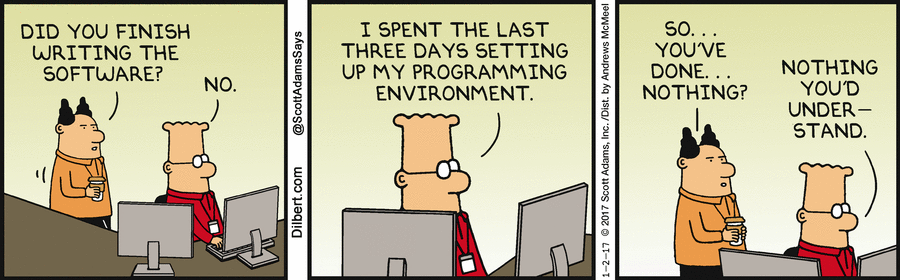

# Skill Hub

## Domain 

The project is a mobile application developed in Flutter using Dart as a programming language, wireframe as UI and Firestore as backend server. This app can be operated in both iOS and Anroid  

## Idea

The idea of the project is as an intra-organizational employment-oriented service that operates via mobile apps. 
The organization that we have used as a test case is BIT Mesra, however, it can be oriented towards any other organization as well. The main goal is to bring convenience to freelancers and startups to hire people from within the community from where they are based.<br />
The app can be very useful to foster expirence of networking to those who has no prior industry exprence and also to those looking for a cost competative employbility from within their organizational structure. 

# Achievements

Our application boasts of several features:
1. The application differentiates between verified and non-verified users. The algorithm will give verification symbols to those who have been consistent users of this platform.
2. The app also uses third party features such as Linkedin to give out users better depth into their prospective employees.
3. The app provides for a basket so that the user can select multiple people at one time without having to go through the same process recursively. 
4.  The app also provides for payment gateway so that the user doesn't have to deal with the hassle of negotiation and engage with third party payments procedure. 
5.  The user also has the feature of deleting any of this selection from the Cart/Basket page if he/she reconsiders their decesion. 

## Description of the codebase

  


       
The code is well arranged into sub-directories which are -
1. The first page is the ```home``` page. 
2. The second page is the ```product``` catalog page. 
3. The thrid page is the ```Cart/Basket``` page. 
4. Finally, the fourth page is the ```payment``` gateway.

# How to Run



1. Make sure Flutter is installed in your system.
2. Fork this repository.
3. Clone the forked repository:
~~~
git clone https://github.com/<your github username>/student_store
~~~
4. Add a remote to the upstream repository:
~~~
# typing the command below should show you only 1 remote named origin with the URL of your forked repository
git remote -v
# adding a remote for the upstream repository
git remote add upstream https://github.com/bodhi996/IEEE_Comp.github
~~~
5. Open the repository in Android Studio.
6. Crate an emulator in AVD manager. 
7. Run the application.
8. Create a new issue if you face any difficulties (after browsing through StackOverflow on your own) and someone will help you 😁


